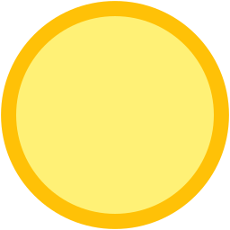
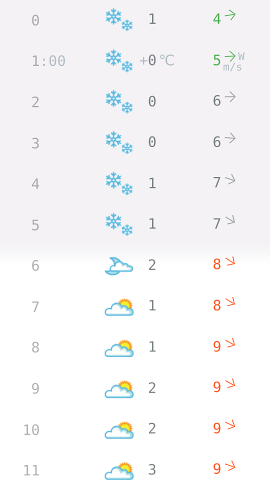

# test-react-redux-weather



[![Dependency Status][depstat-image]][depstat-url]
[![DevDependency Status][depstat-dev-image]][depstat-dev-url]

> React Redux Weather test app

Demo: [vovanr.github.io/test-react-redux-weather][demo]



## Install

```shell
npm install
```

## Run

```shell
npm start
```

## License
MIT © [Vladimir Rodkin](https://github.com/VovanR)

[demo]: https://vovanr.github.io/test-react-redux-weather

[depstat-url]: https://david-dm.org/VovanR/test-react-redux-weather
[depstat-image]: https://david-dm.org/VovanR/test-react-redux-weather.svg?style=flat-square

[depstat-dev-url]: https://david-dm.org/VovanR/test-react-redux-weather
[depstat-dev-image]: https://david-dm.org/VovanR/test-react-redux-weather/dev-status.svg?style=flat-square
